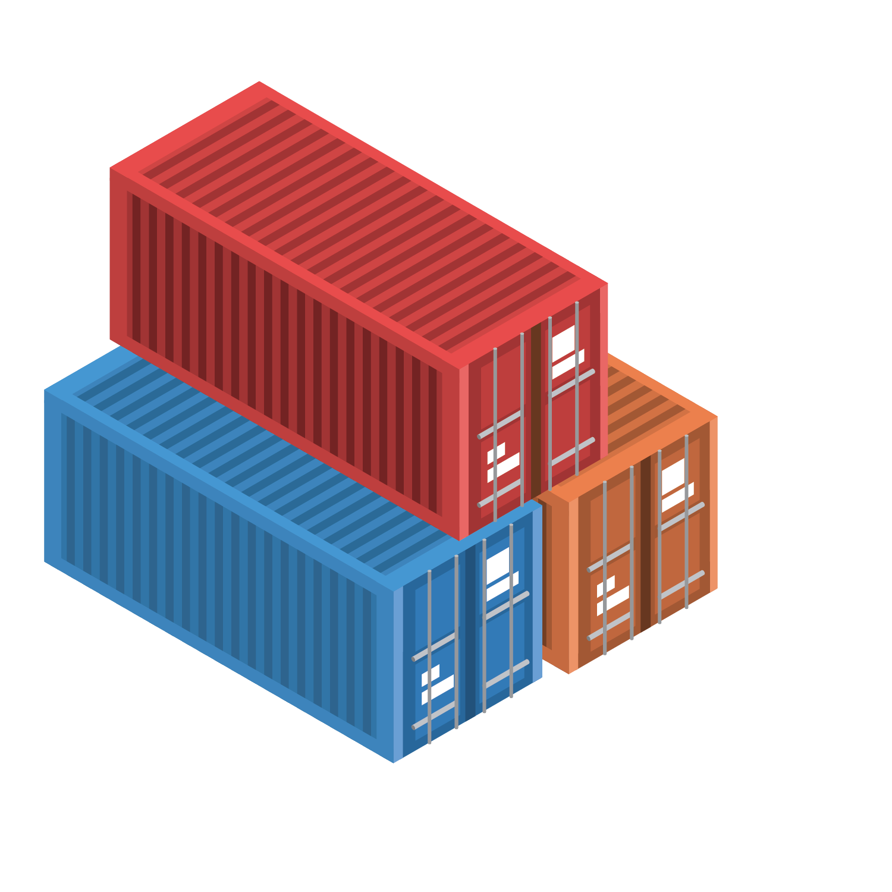

# STL-Containers

## Содержание

В данном проекте представлена реализация контейнеров стандартной библотеки шаблонов(STL) и их основных методов.

Все контейнеры находятся в пространстве имён `s21`. 

Для каждого из контейнеров предусмотрен итератор в виде внутреннего класса контейнера. Над итератерами реализованы стандартные операции:
 1) `++iter`
 2) `--iter`
 3) `iter1 == iter2`
 4) `iter1 != iter2`
 5) `iter1 = iter2`
 6) `*iter`

Проект разделён на 2 части, а именно `my_containers.h` , `my_containers_plus.h`.

`my_containets.h`
 1) `queue` (my_containerAdaptor.h)
 2) `stack` (my_containerAdaptor.h)
 3) `list` (my_list.h)
 4) `map` (my_map.h)
 5) `set` (my_set.h) 
 6) `vector` (my_vector.h)

`my_containers_plus.h`: 
 1) `array` (my_array.h)
 2) `multiset` (my_multiset)

Для каждого из контейнера представлены одинаковые по своей сути конструкторы и деструктор:

 1) `container()` - базовый конструктор .
 2) `container(std::initializer_list<value_type> const& items)` - конструктор с листом инициализации.
 3) `container(const container& other)` - коструктор копирования.
 4) `container(container&& other)` - конструктор перемещения.
 5) `operator=(container&& other)` - оператор перемещения.
 6) `~container()` - деструктор.

## Queue

`queue` - контейнер, с одного конца которого можно добавлять элементы, а с другого - вынимать.

### Методы queue

 1) `const_reference front()` - возвращает ссылку на первый элемент.
 2) `const_reference back()` - возвращает ссылку на последний элемент.
 3) `bool empty()` - проверяет на наличие элементов.
 4) `size_type size()` - возвращает количество элементов.
 5) `void push(const_reference value)` - добавляет элемент в конец.
 6) `void pop()` - удаляет первый элемент.
 7) `void swap(queue& other)` - меняет местами два объекта.

## Stack

`stack` - контейнер, в котором добавление и удаление элементов осуществляется с одного конца.

### Методы stack

 1) `const_reference top()` - возвращает ссылку элемента на вершине элемент.
 2) `bool empty()` - проверяет наличие элементов.
 3) `size_type size()` - возвращает количество элементов.
 4) `void push(const_reference value)` - добавляет элемент на вершину.
 5) `void pop()` - удаление элемента на вершине. 
 6) `void swap(stack& other)` - меняет местами два объекта.

## List

`list` - двусвязный список, элементы которого хранятся в произвольных кусках памяти.

### Методы list

 1) `const_reference front()` - возвращает ссылку на первый элемент.
 2) `const_reference back()` - возвращает ссылку на последний элемент.
 3) `iterator begin()` - возвращает итератор на начало.
 4) `iterator end()` - возвращает итератор на конец.
 5) `bool empty()` - проверяет наличие элементов.
 6) `size_type size()` - возвращает количество элементов.
 7) `size_type max_size()` - возвращает максимальное количество возможных элементов.
 8) `void clear()` - очистка.
 9) `iterator insert(iterator pos, const_reference value)` - вставка элемента по итератору, возвращает позицию итератора, куда был вставлен элемент.
 10) `void erase(iterator pos)` - удаление элемента по итератору
 11) `void push_back(const_reference value)` - добавление элемента в конец.
 12) `void pop_back()` - удалеине элемента в конце. 
 13) `void push_front(const_reference value)` - добавление элемента в начало. 
 14) `void pop_front()` - удаление элемента в начале.
 15) `void swap(list& other)` - меняет местами два объекта.
 16) `void merge(list& other)` - объединяет переданный объект с текущим.
 17) `void splice(const_iterator pos, list& other)` - переносит элементы из другого объекта начиная с позиции итератора. 
 18) `void reverse()` - меняет порядок обращения к элементам.
 19) `void unique()` - удаляет последовательные дублирующиеся элементы.
 20) `void sort()` - сортирует все элементы. 

## Map

`map` - упорядоченный ассоциативный массив пар элементов, состоящих из ключей и соответствующих им значений. Ключи должны быть уникальны.

### Методы map

 1) `T& at(const Key& key)` - возвращает ссылку на элемент с проверкой границ.
 2) `T& operator` - возвращает ссылку на элемент.
 3) `iterator begin()` - возвращает итератор на начало.
 4) `iterator end()` - возвращает итератор на конец.
 5) `bool empty()` - проверяет наличие элементов.
 6) `size_type size()` - возвращает количество элементов.
 7) `size_type max_size()` - возвращает максимальное количество возможных элементов.
 8) `void clear()` - очистка.
 9) `std::pair<iterator, bool> insert(const value_type& value)` - вставляет элемент по значению и возвращает пару, позиция итератора и удалось ли вставить.
 10) `std::pair<iterator, bool> insert(const Key& key, const T& obj)` - вставляет элемент по ключу и возвращает пару, позиция итератора и удалось ли вставить.
 11) `std::pair<iterator, bool> insert_or_assign(const Key& key, const T& obj)` - вставляет элемент или присваивает значение элементу по ключу, если такой ключ уже существует.
 12) `void erase(iterator pos)` - удаляет элемент по позиции итератора.
 13) `void swap(map& other)` - меняет местами два объекта.
 14) `void merge(map& other)` - объединяет переданный объект с текущим.
 15) `bool contains(const Key& key)` - проверяет, существует ли элемент по заданному ключу.

## Set

`set` - упорядоченное множество уникальных элементов.

### Методы set

 1) `iterator begin()` - возвращает итератор на начало.
 2) `iterator end()` - возвращает итератор на конец.
 3) `bool empty()` - проверяет наличие элементов.
 4) `size_type size()` - возвращает количество элементов.
 5) `size_type max_size()` - возвращает максимальное количество возможных элементов.
 6) `void clear()` - очистка.
 7) `std::pair<iterator, bool> insert(const value_type& value)` - вставка элемнта, возвращает пару, позиция итератора куда был вставлен элемент и удалось ли вставить.
 8) `void erase(iterator pos)` - удаление элемента по позиции итератора.
 9) `void swap(set& other)` - меняет местами два объекта.
 10) `void merge(set& other)` - объединяет переданный объект с текущим.
 11) `iterator find(const Key& key)` - возвращает итератор на элемент с указанным ключом.
 12) `bool contains(const Key& key)` - провеяет, есть ли элемент с указанным ключом.

## Vector

`vetor` - C-подобный динамический массив произвольного доступа с автоматическим изменением размера при добавлении/удалении элемента.

### Методы vector

 1) `reference at(size_type pos)` - возвращает ссылку на элемент с проверкой границ.
 2) `reference operator` - возвращает ссылку на элемент.
 3) `const_reference front()` - возвращает ссылку на первый элемент.
 4) `const_reference back()` - возвращает ссылку на последний элемент.
 5) `iterator data()` - прямой доступ к базовому массиву.
 6) `iterator begin()` - возвращает итератор на начало.
 7) `iterator end()` - возвращает итератор на конец.
 8) `bool empty()` - проверяет наличие элементов.
 9) `size_type size()` - возвращает количество элементов.
 10) `size_type max_size()` - возвращает максимальное количество возможных.
 11) `void reserve(size_type size)` - выделяет память дополнительную память под элементы и копирует существующие элементы в неё.
 12) `size_type capacity()` - возвращает количество возможных элементов для хранения в данный момент.
 13) `void shrink_to_fit()` - освобождает неиспользуемую память.
 14) `void clear()` - очистка.
 15) `iterator insert(iterator pos, const_reference value)` - вставка элемента по позиции итератора.
 16) `void erase(iterator pos)` - удаление элемента о итератору.
 17) `void push_back(const_reference value)` - вставка элемента в конец.
 18) `void pop_back()` - удаление последнего элемента.
 19) `void swap(vector& other)` - меняет местами два объекта.

## Array

`array`- это последовательный контейнер, инкапсулирующий в себе статический массив.

### Методы array

 1) `reference at(size_type pos)` - возвращает ссылку на элемент с проверкой границ.
 2) `reference operator` - возвращает ссылку на элемент.
 3) `const_reference front()` - возвращает ссылку на первый элемент.
 4) `const_reference back()` - возвращает ссылку на последний элемент.
 5) `iterator data()` - прямой доступ к базовому массиву.
 6) `iterator begin()` - возвращает итератор на начало.
 7) `iterator end()` - возвращает итератор на конец.
 8) `bool empty()` - проверяет наличие элементов.
 9) `size_type size()` - возвращает количество элементов.
 10) `size_type max_size()` - возвращает максимальное количество возможных элементов. 
 11) `void swap(array& other)` - меняет местами два объекта.
 12) `void fill(const_reference value)` - присваивает всем элементам в контейнере заданное значение.

## Multiset

`multiset` - то же, что и set, но позволяет хранить повторяющиеся элементы.

### Методы multiset

 1) `iterator begin()` - возвращает итератор на начало.
 2) `iterator end()` - возвращает итератор на конец.
 3) `bool empty()` - проверяет наличие элементов.
 4) `size_type size()` - возвращает количество элементов.
 5) `size_type max_size()` - возвращает максимальное количество возможных элементов.
 6) `void clear()` - очистка.
 7) `iterator insert(const value_type& value)` - вставка элемнта, возвращает итератор на позицию, куда был вставлен элемент.
 8) `void erase(iterator pos)` - удаление элемента по позиции итератора.
 9) `void swap(multiset& other)` - меняет местами два объекта.
 10) `void merge(multiset& other)` - объединяет переданный объект с текущим.
 11) `iterator find(const Key& key)` - возвращает итератор на элемент с указанным ключом.
 12) `bool contains(const Key& key)` - провеяет, есть ли элемент с указанным ключом.
 13) `size_type count(const Key& key)` - возвращет количество элементов в контейнере, равных переданному.
 14) `iterator find(const Key& key)` - возвращает итератор на элемент с искомым значением.
 15) `bool contains(const Key& key)` - проверка, содержит ли данный элемент. 
 16) `std::pair<iterator,iterator> equal_range(const Key& key)` - возвращает итератор на начало и конец множества элементов совпадающих с данным значением.
 17) `iterator lower_bound(const Key& key)` - возвращает итератор на первый элемент не меньший переданного значения.
 18) `iterator upper_bound(const Key& key)` - возвращает итератор на первый элемент больший переданного значения.

Cборка проекта осуществляется с помощью g++ 9.4.0 и makefile на Linux. Тесты написаны на google test.